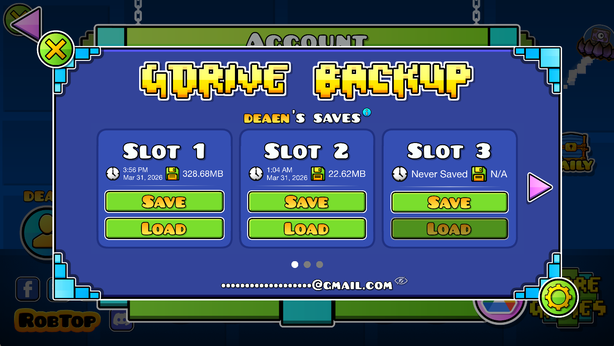

<h1>GDrive Backup</h1>
<h3> Save & load your data to Google Drive!</h3>

## <cj>Features:</c>
- **Backup and load your data to Google Drive!**
- **No file size limits!**
- **Infinite save slots!**
- **Unique slots for each GD account!**
- **Super simple Google Sign in!**

#### you can find the mod in the account menu in GD's settings!

## <co>Contact:</c>
Please report any issues on GitHub, or just contact me on one of the socials on my website. <cl>(discord/twitter prefered)</c>

## <cd>Credits:</c>
Thanks to camila314 for the [Geode URI API](https://github.com/camila314/geode-uri)!